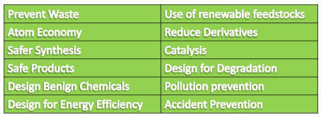

Green Chemistry focuses on :
• Reduction, recycling and/or eliminating toxic substances
• Finding creative, alternative routes to minimize impact on
the environment
• More eco-friendly green alternative toconventional
chemistry practices
• Provides sustainable development, sustainable business and
sustainable living practices

---
### Twelve Principles of Green Chemistry

1. **Prevent Waste :**
- Synthesis **only targeted product** with minimum or no by products/waste
- If waste is produced , it involves cost and time to treat and safely dispose it, as a result production cost increases

2. **Atom Economy**:
Synthetic methods should be 
- designed to maximize the **incorporation of all materials used** into the final product
- The chemical processes should have **maximum product yield**
- Atom economy can be calculated using the relation
 - % Atom Economy = (**FW of atoms utilized/FW of all reactants**) X 100
 
Atom Economy in a Substitution Reaction - **moderate**
Atom Economy in Elimination Reactions - **low**
Atom Economy in Addition Reactions -**100**% 
Atom Economy in Rearrangement Reactions -**100**%

> For a **green synthesis** atom economy must be maximum (100%)

3. **Safer Synthesis**:
- The synthetic processes should be 
	-  designed so as to minimize or prevent the **production of hazardous substances** 
- **Necessary safety precautions** have to be taken while processing to protect human health and environment
- eg: Polyurethane is manufactured conventionally using and alcohol. However, **isocyanate** is produced using phosgene, a toxic gas 
- The alternative method by green synthesis of polyurethane eliminates the use of phosgene and uses CO2

4. **Safe Products** :
Chemical products should be designed
- to preserve efficacy of function while reducing toxicity
- Products should not have any side effects on the
people using it and on the environment
- It is envisaged to produce the chemical products
specially those being used in cosmetics, pharmaceuticals, etc.

5. **Design Benign Chemicals** :
- Use safer solvents and reaction conditions
- Avoid using solvents, separation agents, or other auxiliary
chemicals
- If these chemicals are necessary, use innocuous chemicals
- Chemical syntheses are assisted by solvent medium:
 -  recommended to use alternative solvents , greener in nature such as aqueous medium, liquid carbon-dioxide, ionic liquids(N-alkyl pyridinium cation with BF4-), or solvent free systems
 - **Avoid harmful solvents** like chloroform, pyridine which are known to cause health hazard, are carcinogenic to human beings and animals or cause severe damage to environment
 
 6. **Design for Energy efficiency** :

 Chemical processes are to be designed in such a way that they are **less energy intensive** 
 - reactions occurring at mild conditions 
 - require less time to complete

For this purpose it is worthwhile to utilize 
- Bio-catalyst, homogeneous and heterogeneous catalyst 
which reduces the energy of activation 
- Modern techniques such as solvent free synthesis, 
supercritical fluid systems, microwave irradiation, and 
ultrasound

7. **Use of renewable feedstock** :
- Raw material or feedstock used as starting material should be renewable rather than depleting wherever technically and economically possible
- Use of renewable feedstock such as **biomass** and **agricultural wastes** are strongly recommended rather than using non-renewable resources such as coal, petroleum-based raw materials, etc.

8. **Reduce Derivatives**:
- Avoid unnecessary derivatization
- temporary modification should be avoided whenever possible as they generate waste
- the atom efficiency is reduced as the protective group is not incorporated in the final product e.g: blocking group, protection/ deprotection

9. **Catalysis**:
- Use catalytic reactions, as catalysts
- Speed up the reaction can be recycled and are highly selective 
-  less energy consumption during reaction
-  obtaining high yield of product of high purity

Unlike stiochiometric reactions which are energy 
intensive require excessive reagents

10. **Design for Degradation** :
- Design chemicals and products to **degrade after use** to innocuous substances after use so that they **do not** **accumulate** in the environment
- Especially applicable to: 
 - insecticides
 - pesticides 
 - polymers which tend to persist in the environment and are known to cause bioaccumulations

11. **Pollution Prevention** :
-  Real-time analysis (quality control)
 -  Continuously monitor and control the formation of hazardous substances
 - Any unreacted reactant can be recycled in order to minimize the use of chemicals

12. **Accident Prevention** :
- Minimize the potential for accidents
 - Chemicals chosen for processes should be such which minimise accidents in the form of fires, explosions, and toxic releases to the environment 
 - Manufacturing plants should be well equipped with safety mechanisms
 - The Bhopal gas tragedy is one of the worst industrial disasters 
---
> Green chemistry is a set of principles which emphasises on
- environmentally benign chemical synthesis with a view to  devise pathways for the prevention of pollution.
- bringing a paradigm shift in chemical processing to achieve sustainable development.
