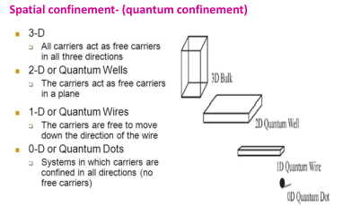
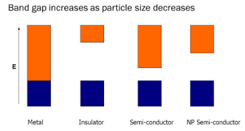

> The prefix 'nano' is derived from the Greek word for dwarf. 
> 1 nm == 10 H or 5 Si atoms aligned in a line.

---

- **Nanomaterials**: Materials with at least one external dimension between 1 and 100 nm.
- **Nanoscience** is the study of phenomena and synthesis, characterization, exploration and exploitation of nanostructured materials.
- **Nanotechnologies**: are the design, characterization, production and application of structures, devices and systems by controlling shape and size at nanometer scale

Dimensions of nanomaterials lie in between bulk material and atoms/molecules upto to 1 μm bulk properties are observed. For smaller sizes quantum effects are seen as the dimensions are closer to atoms or molecules

---
### Properties of nanomaterials are different from bulk materials

- Au-bulk is **yellowish** in colour, and 100 Au atoms arranged in cube are **red** in colour.
- Al which is stable becomes **combustible** in the nanoparticle range and is used as solid fuel in rocket propulsion
- **Melting point** of materials is lower in nano-range

### So how do we see these small things?

- Scanning electron microscope (SEM)
- Transmission electron microscopy (TEM)
- Scanning tunneling microscope (STM)
- Atomic force microscope (AFM)

---
# Classification of Nanomaterials

## Zero Dimensional Nanomaterials (0D)

Materials having all the dimensions within the nanorange where no 
dimension is allowed to be outside of nanorange. 
Examples include:
- Quantum dots
- Nanoclusters (e.g., fullerene)

## One Dimensional Nanomaterials (1D)
Materials having one of their dimensions out of the nanorange. 
Examples include:
- Nanotubes
- Nanowires

## Two Dimensional Nanomaterials (2D)
Materials having two of their dimensions out of the nanorange. 
Examples include:
- Nanofilms
- Nanocoatings

## Three Dimensional Nanomaterials (3D)
Materials having all the three dimensions out of the nanorange. Examples include:
- Dispersions of nanoparticles
- Bundles of nanowires

---
### Different from bulk properties

Reasons: 
- Large fraction of surface atoms / unit volume: Properties are dictated by surface atoms rather than bulk atoms
- Eg : Pt sheet  versus Pt powder
- Large surface energy : Surface atoms are held with less force as  compared to bulk. Surface activity is high. E.g. : Al 

> A block has a surface area of 6 square meters (1 square meter on a side x 6 sides) and a volume of 1 cubic meter. In this case, the surface area to volume ratio for the ice block is 6/1 or 6.

On decreasing the size the electron gets confined to the particle (confinement 
effects) leading to:  
- increase in bandgap energy
- band levels get quantized (discrete)

On decreasing the size the electron gets confined to the particle (confinement effects) leading  to: 
- increase in bandgap energy
- band levels get quantized (discrete).

---
#### Properties of Nanomaterials
- Properties of any bulk material are independent of its size whereas properties of nanomaterials change with size
- Properties of a bulk material can be altered only by altering their structure and composition

---
### Surface Area dependant properties
- Many physical and chemical properties of a material depend on its
surface properties
- Surface area is enormously increased on moving from bulk to nano scale.
- Nanomaterials have a significant proportion of atoms existing at the surface
- Properties like catalytic activity, gas adsorption depend on surface area
- e.g. Bulk gold is catalytically inactive but gold nanoparticles are catalytically very active for selective redox reactions
- Surface energy is also high so chemical reactivity is high
- e.g. Aluminum becomes combustible

---
### Electrical Properties
Electrical conductivity decreases for nanoparticles as compared to
bulk material
- Due to spatial confinement
- The electronic bands in bulk material are continuous
- In nano size materials the electronic bands become discrete and the band gap increases
- Some metals which are good conductors in bulk become semiconductors and insulators as their size is decreased to nano

---
- Due to surface scattering: In the case of bulk materials, the conduction of electrons is delocalized and electron can move in all dimensions. As they travel their paths, the electrons are primarily scattered by various interactions with phonons and impurities, resembling a random walk process.
- Electrical conductivity decreases due to surface scattering
- Electrons have a mean free path
- If dimensions of the nanomaterial is smaller than the mean free path of the electron, elastic or inelastic surface scattering can happen.
- Elastic scattering will not affect conductivity but when inelastic scattering happens, the scattered electron loses its velocity and electrical conductivity decreases

### Optical Properties
- Nanomaterials show unique optical properties
- Colour depends on the size of the particles
- Due to increase in band gap
- Due to Surface Plasmon Resonance

### Increase in Energy gap
- Increases in energy gap between the valence band (HOMO) and conduction band(LUMO)
- As size of nanoparticles decreases the energy gap increases and the  wavelength of light absorbed moves towards smaller values. This is referred to as ‘blue shift’ 
- eg. colloidal suspensions of gold nanoparticles:
- Gold spheres of > 50 nm  absorb at λ = 575 nm 
- Gold spheres of 10- 20 nm absorb at λ = 524 nm
- Gold spheres of 2-5 nm absorb at λ = 517 nm

### Surface plasmon resonance (SPR)

- Metals have positive lattice points surrounded by a sea of electrons
- When radiation falls , the surface electrons are polarised
- These electrons oscillate with a frequency
- Collective oscillations of these electrons is called Plasmons
- When the plasmon frequency matches with the frequency of radiation falling, resonance occurs and radiation is absorbed and the material appears coloured
- Plasmon frequency depends on size, shape and nature of metal
- As size of nanoparticle changes, colour changes

---
### Mechanical properties

> Strength of nanomaterials is greater than bulk material

- Mechanical properties may reach theoretical strength , which is one or 
two orders of magnitude higher than that of the bulk materials.
E.g. Bending of bulk Cu happens readily but Cu particles < 50 nm are 
considered super hard materials that do not show same malleability and 
ductility as bulk Cu.
- The reason for this high strength is due to reduced probability of defects
Large lattices in bulk materials have imperfections  like dislocations, and 
vacancies but for lattice with smaller cross-section, there is less probability 
of finding imperfections.

---
### Thermal properties

- Low melting point and phase transition temperature
- Due to a large fraction of surface atoms compared to bulk.
- Atoms or molecules on the surface are bound by lesser number of bonds as compared to the atoms in the bulk. 
- The number of bonds need to be broken per atom during melting is less in nanomaterials
- Decrease in thermal conductivity
- Size of the particles is smaller than the path length of phonons arising due to lattice vibrations.
- Phonon scattering results in decrease in thermal conductivity 

---
### Magnetic Properties

- Magnetic properties of nanomaterials are distinctly different from that of the bulk materials. 
- In ferromagnetic materials like Fe,Co,Ni , ferromagnetism changes to superparamagnetism in the nanometer scale due to the high surface 
energy. The domains can flip directions. In the presence of magnetic field, they get magnetised with high susceptibilities.
- Bulk gold and platinum are non-magnetic but at the nanosize they act as magnetic particles

---
### Applications

- Medicine: For targeted drug delivery to enhance effectiveness, injectible nanobots which can serve as detectors, informers of early disease and perhaps repair metabolic defects 
- antibacterial activity - Ag nanoparticles
- Energy storage: as electrodes in fuel cells- high surface area
- Catalysis: Nanocrystalline materials have very large surface area due to their small size. Therefore, they are very active with regards to their physical, chemical, and mechanical properties. Au, Ag nanoparticles – good catalysts
- Oxygen reduction reaction catalysts for fuel cells & metal-air batteries 
- CO oxidation catalys
- Consumer electronics: Nanophosphors for good resolution in HDTV- The resolution of a monitor or television is subject to the size of the pixel. These pixels are fundamentally composed of materials known as “phosphors,” which glow when struck by a stream of electrons within the cathode ray tube (CRT). The resolution enhances with a reduction in the pixel size or the phosphors. Nanocrystalline zinc selenide, cadmium sulfide, zinc sulfide, and lead telluride are potential materials for enhancing the resolution of monitors 
- Nanophosphors in white light emitting diode

---
## Environment:

- Elimination of pollution using catalytic converters - Owing to their improved chemical 
activity, nanomaterials can be employed as catalysts to react with toxic and noxious gases 
- Water purification by Carbon nanotubes
- Cosmetics: ZnO and TiO2 in sunblocks
