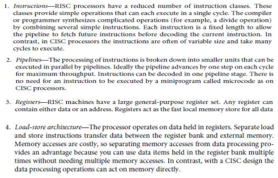
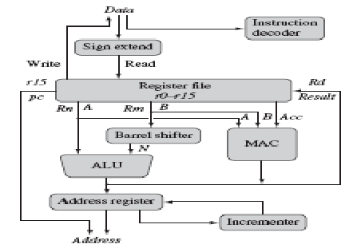

An Embedded system is an electronic / electromechanical system designed to perform a specific function and is a combination of both Hardware and Software. It is unique and the hardware and firmware are highly specialized to the application domain.

It's a micro-controller or microprocessor-based system which is designed to perform a specific task. For example, a fire alarm is an embedded system; it will sense only smoke.

---

- **Sensors**: a sensor is a transducer device that converts energy from one form to another for any measurement or control purpose. Ex: Temperature Sensor, Pressure sensor.
- **Actuators**: An actuator is a form of transducer device (mechanical or electrical) which converts signals to corresponding physical motion. It is an output device. Ex: Electric motors, Stepper motors, LED (Light Emitting Diode).

---

## Purpose of Embedded Systems

- Data Collection/ Storage/Representation
- Data Communication
- Data processing, Monitoring
- Control Application specific user interface.

---

## Applications of Embedded Systems

- Consumer electronics - Televisions and digital cameras, computer printers, video game consoles and home entertainment systems like PS4
- Household appliances – Refrigerators, washing machines, microwave ovens, air conditioners
- Home automation - switching off electrical appliances like air-conditioners or refrigerators, security alarms.
- Banking and retail - Automated teller Machine (ATM)
- Measurement and Instrumentation - Digital CRO, Digital Multi meter, Logic Analyzer
- Health care - Scanners like those for MRI, CT, ECG machines devices to monitor blood pressure and heartbeat
- Automotive industry. - Airbags, anti-lock braking system, cruise control, rain-sensing wipers, emission control, traction control, automatic parking

### Characteristics of an Embedded Systems

- A system which is a combination of special purpose hardware and embedded OS for executing a specific set of applications.
- May or may not contain an operating system for functioning.
- The firmware (software permanently installed in the device) of an ES is pre-programmed and it is non-alterable by the end user.
- Application-specific requirements are the key deciding factors.
- Highly tailored to take advantage of the power-saving modes supported by the hardware and the OS.
- Execution behavior is deterministic for certain types of ES like “Hard Real-Time Systems” (strict deadline).
- The response time requirement is critical for some critical systems.
- Embedded systems are created to perform the task within a certain time frame. It must, therefore, perform fast enough.

---

#### Based on Generation

1. **First Generation** - Built around 8-bit microprocessor & micro-controller, Simple in hardware circuit & firmware developed. Ex: Digital telephone keypads
2. **Second Generation** - Built around 16-bit μp & 8-bit μc, They are more complex & powerful than 1G μp & μc, Ex: SCADA systems *==Supervisory Control & Data Acquisition System==*
3. **Third Generation** - Built around 32-bit μp & 16-bit μc, Concepts like Digital Signal Processors(DSPs), Application Specific Integrated Circuits(ASICs) evolved. Ex: Robotics, Media.
4. **Fourth Generation** - Built around 64-bit μp & 32-bit μc, The concept of System on Chips (SoC), Multicore Processors evolved, Highly complex & very powerful. Ex: Smart Phones

---

### Based on Complexity and Performance

- **Small Scale Embedded Systems** - Simple in application need, Performance not time-critical, Built around low-performance & low-cost 8 or 16 bit μc, Ex: Electronic toy
- **Medium Scale Embedded Systems** - uses a single 16-bit or 32-bit μc or multiple microcontrollers linked together. These systems have a lot of hardware as well as software complexities, hence are not preferred by many Ex: Industrial machines.
- **Large Scale Embedded Systems** - Built around 32 or 64 bit RISC μp/μc or PLDs or Multicore Processors, functions on multiple algorithms that result in complexities in both hardware and software. They often need a processor that is configurable and logic array that can be programmed. Response is time-critical. Ex: Mission-critical applications

---

### Based on Deterministic Behaviour

- **Deterministic/Non-Deterministic Real-time ES**: Hard/Soft Real-time implies deterministic timing behavior –OS services consume only known & expected amount of time regardless of the number of services. RTOS decides which application should run in which order & how much time needs to be allocated for each application. Time Management is the basic function of RTOS. Examples: Digital camera, Thumb Impression Reader & ATM

---

## Core of the Embedded Systems

- Embedded Systems are built around a central Core
- General Purpose and Domain Specific Processors
  - Microprocessors
  - Microcontrollers
  - Digital Signal processors
- Application Specific Integrated Circuits (ASIC's)
- Programmable Logic Devices (PLD's)
- Commercial Off the Shelf Components (COTS)

---

## microprocessor vs microcontroller

``` plain
| Criteria             | Microprocessor                                                                                           | Microcontroller                                                                                                                                                                                                 |
| -------------------- | -------------------------------------------------------------------------------------------------------- | --------------------------------------------------------------------------------------------------------------------------------------------------------------------------------------------------------------- |
| Description          | A silicon chip representing CPU, performing ALU operations according to pre-defined set of instructions. | A highly integrated chip that contains Scratch pad RAM, special and general purpose register arrays, on-chip ROM/FLASH memory for program storage, timer and interrupt controller units and dedicated I/O ports |
| Dependency           | It is a dependent unit.                                                                                  | It is an independent unit.                                                                                                                                                                                      |
| Design and Operation | General purpose design and operation.                                                                    | Application-oriented or domain-specific.                                                                                                                                                                        |
| Built-in I/O Ports   | Doesn't contain a built-in I/O port.                                                                     | Contains multiple built-in I/O ports.                                                                                                                                                                           |
| Target Market        | Targeted for high-end market where performance is important.                                             | Targeted for Embedded market.                                                                                                                                                                                   |
| Power Saving Options | Limited power saving options.                                                                            | Includes a lot of power-saving features.                                                                                                                                                                        |
```

---

## Digital Signal Processor

- Powerful special purpose 8/16/32 bit microprocessor designed specifically to meet the computational demands and power constraints of different applications.
- 2 to 3 times faster than GPP in signal processing applications.
- It implements algorithms in hardware which speeds up the execution.
- A typical DSP incorporates the following units:
  - Program Memory: storing program required by DSP.
  - Data Memory: Storing temporary variables and data/signal to be processed.
  - Computational Engine: Performs the signal processing in accordance with the stored program memory.
  - I/O unit: Acts as an interface between the outside world and DSP (capturing signals and delivering processed signals).
- Examples: Audio-video signal processing, telecommunication and multimedia applications, real-time calculations like FFT, DFT, SOP, etc.

---

## General Purpose Processor Vs Application Specific Instruction Set Processor

``` plain
| Criteria                                   | General Purpose Processor (GPP)                                | Application Specific Instruction Set Processor (ASIP)                                                                                                                              |
| ------------------------------------------ | -------------------------------------------------------------- | ---------------------------------------------------------------------------------------------------------------------------------------------------------------------------------- |
| Designed for                               | Designed for general computational tasks. Ex: laptop, Desktop  | The processor contains architecture and instruction set optimized to specific domain/application requirements. Ex: SoC, DSP's used in automotive, telecom, media applications, etc |
| Components                                 | It contains ALU and Control Unit.                              | It incorporates a processor and on-chip peripherals demanded by the application requirement, program, and data memory.                                                             |
| Production and Cost                        | High volume of production/low cost per unit.                   | -                                                                                                                                                                                  |
| Role in Architectural Spectrum             | -                                                              | It fills the architectural spectrum between GPP and ASIC's.                                                                                                                        |
```

---

## Application Specific Integrated Circuits (ASICs)

- It is a microchip designed to perform a specific or unique application.
- Used as a replacement for conventional general-purpose logic chips.
- It integrates several functions into a single chip and consumes very small area in the total system.
- It can be pre-fabricated for a special application or it can be custom fabricated by using the components from a re-usable building block library of components.
- Non-Recurring Engineering Charge (NRE): It is a non-refundable initial investment for the fabrication of ASICs and it is a one-time investment.
- Application Specific Standard Product (ASSP): If the Non-Recurring Engineering Charges are borne by a third party and the Application Specific Integrated Circuit (ASIC) is made openly available in the market, the ASIC is referred to as ASSP.
  - Example: ADE7760 Energy Meter ASIC developed by Analog Devices for Energy Metering applications.

### Programmable Logic Devices (PLDs)

> PLDs can be reconfigured to perform any number of functions at any time.
>
#### Features of PLDs

- It has a wide range of logic capacity, features, speed, and voltage characteristics.
- Designers use inexpensive software tools to quickly develop, simulate, and test their designs.
- There are no Non-Recurring Engineering (NRE) costs, and the final design is completed quickly.
- PLDs are based on rewritable memory technology.

#### Two major types of PLDs are

1. CPLDs: offer a smaller amount of logic, up to about 10,000 gates, and offer very predictable timing characteristics suitable for critical control applications.
   - Example: Xilinx Coolrunner
2. FPGAs: offer the highest amount of logic density, the most features, and the highest performance.
   - Example: Xilinx VirtexTM.

---

## Commercial Off-the-Shelf Components (COTS)

> Provides easy integration and interoperability with existing system components. It can be developed around GPP, Domain-specific Processor, ASIC, or PLDs.

```
| Advantages                                                                                                    | Disadvantages                                                                                                                                                                                                                   |
| ------------------------------------------------------------------------------------------------------------- | ------------------------------------------------------------------------------------------------------------------------------------------------------------------------------------------------------------------------------- |
| Readily available in the market, cheap, and developers can cut down their development time to a great extent. | Due to rapid changes in technology, if the COTS component is withdrawn by the manufacturer or production is discontinued, it will adversely affect a commercial manufacturer of ES which makes use of the specific COTS product |
```

---

## Memory

Memory is required for holding data temporarily during certain operations.

- **On-chip memory:** built-in memory.
- **Off-chip memory:** external memory connected with the controller/processor for storing controller algorithm.
- **Program Storage Memory:** Also called code storage memory of an ES, it stores the program instructions. It retains its contents even after the power to it is turned off (non-volatile storage memory).

---

### Program Storage Memory (ROM)

> Depends on fabrication, erasing, and programming technique, ROM is divided as follows:

A) Masked ROM (**MROM**)

- One-time Programmable device
- Uses hardwired technology to store the data
- Low cost for high volume of production
- Good candidate for storing the embedded firmware for low-cost embedded devices
- Limitation is its inability to modify the device firmware against firmware upgrades.

B) Programmable Read Only Memory (**PROM** / **OTP**)

- The end user is responsible for programming this memory
- This memory consists of polysilicon or nichrome wires functionally viewed as fuses
- Fuses which are not blown/burned represent logic “1”, whereas fuses which are blown/burned represent logic “0”
- OTP is used in commercial production of ES

C) Erasable Programmable Read Only Memory (**EPROM**)

- EPROM gives flexibility to re-program the same chip
- Stores bit information by charging the floating gate of an FET to a high voltage
- Contains a quartz crystal window, which is exposed to UV rays for 20 to 30 minutes to erase the entire memory
- Limitation is erasing the memory using UV rays is a tedious and time-consuming process.

D) Electrically Erasable Programmable Read Only Memory (**EEPROM**)

- Information contained in this memory can be erased and re-programmed in-circuit using electrical signals at register/byte level
- Provides greater flexibility for system design
- Limitation is its capacity (only a few kilobytes).

E) **FLASH**

- Latest ROM technology which combines the re-programmability of EEPROM and high capacity of standard ROMs
- Organized as sectors/pages
- Stores information in an array of floating gates of an MOSFET
- Each sector is erased before re-programming, done at sector/page level without affecting sector/page
- Typical erasable capacity is 1000 cycles
- Example: W27C512 from WINDBOND (64 KB FLASH memory)

F) **NVRAM** (Non-volatile RAM / non-volatile storage memory)

- RAM with battery backup
- Lifespan is around 10 years
- Example: DS1644 from Maxim/Dallas (32 KB NVRAM)

---

### Read-Write Memory / Random Access

> RAM: is working memory of a controller/processor where it can read from it and write to it.
> Volatile in nature (requires power to maintain the stored information)

A) Static RAM (**SRAM**)

- It is the fastest form of RAM available (Resistive networking and Switching capabilities).
- Made up of flip-flops and stores data in the form of voltage.
- Realized using six transistors (MOSFET) out of which four are for building the latch part of the memory cell and two for controlling the access.
- Major limitation: low capacity and high cost

B) Dynamic RAM (**DRAM**)

- Stores the data in the form of charge
  - Advantage: high density and low cost
  - Disadvantage: Since it is stored as charge, it will get leaked off with time, so refreshing is needed
- Special circuits called DRAM controllers are used for refreshing the operation

---

### Difference between SRAM and DRAM

1. **SRAM**
   - Made up of 6 CMOS Transistors (MOSFET)
   - Doesn't require refreshing
   - Low capacity
   - Fast in operation. Typical access time is 10ns

2. **DRAM**
   - Made up of a MOSFET and a capacitor
   - Requires refreshing
   - High Capacity
   - Less expensive
   - Slow in operation. Typical access time is 60ns
   - Write Operation is faster than read operation

---
C) **NVRAM** (Non-volatile RAM)

- RAM with battery backup.
- Contains static RAM based memory
- Lifespan is around 10 years
  - Example: DS1744 from Maxim/Dallas (32 KB NVRAM)

D) Memory according to the Type of Interface

- **Parallel** Interface: Parallel data lines for an 8-bit processor/controller will be connected to the memory (memory size is in terms of kilobytes)
- **Serial** Interface: I2C: 2-line serial interface (used for data storage memory like EEPROM, memory size is in terms of kilobits)
  - Example: Atmel Corporations AT24C512 (512 K bits/ 2-wire interface)
- Serial Peripheral Interface (SPI): 2+n line interface where n stands for the total number of SPI bus devices in the system
- Single wire interconnection.

---

### I/O Subsystem

> The I/O subsystem of the embedded system facilitates the interaction of the embedded system with the external world.

- Light Emitting Diode (LED)
- 7 Segment LED display
- Optocoupler - transfers electrical signals between two isolated circuits by using light.
- Stepper Motor - DC motors that move in discrete steps. Electromagnetic device that converts digital pulses into mechanical shaft rotation.
- Relay - switches that open and close circuits electro-mechanically or electronically. Either make or break a circuit.
- Piezo Buzzer - electronic device that's used to produce a tone, alarm, or sound.
- Push Button Switch - two-position devices actuated with a button that is pressed and released.
- Keyboard - mechanisms under the key-caps on a mechanical keyboard that enable you to type faster and more precisely.
- Programmable Peripheral Interface (**PPI**) - general-purpose programmable I/O device designed to interface the CPU with its outside world such as ADC, DAC, keyboard, etc.

---

### Communication Interface

- Device/ Board level communication Interface (Onboard Communication Interface)
  - The communication channel which interconnects the various components within an embedded product.
  - Example: Serial Interface like I2C, SPI, UART (Universal Asynchronous Receiver/Transmitter), 1-Wire & parallel bus interface
- Product level Communication Interface (External Communication Interface)
  - Responsible for data transfer between the embedded system and other devices or modules.
  - It can be wired media, wireless media, serial or parallel interface.
  - Example: IR (Infrared), Bluetooth, Wi-Fi (Wireless Fidelity), RS232c (Recommended Standard 232), USB (Universal Serial Bus), Ethernet, etc.

---

### Onboard communication Interfaces

- Inter Integrated Circuit (I2C)
  - It is a synchronous bi-directional half duplex (devices can only transmit data in two directions but not at the same time) two-wire serial interface bus.
  - Provides an easy way of connection between a microprocessor/microcontroller system and the peripheral chips in television sets.
  - It comprises two bus lines:
    - Serial Clock (SCL): Responsible for generating synchronization clock pulses
    - Serial Data (SDA): Responsible for transmitting the serial data across devices.
  - It supports multimasters on the same bus.
  - It supports three different data rates:
    - Standard Mode: Data rate up to 100 Kbps
    - Fast Mode: Data rate up to 400 Kbps
    - High-Speed Mode: Data rate up to 3.4 Mbps
  - It is a shared bus system. The devices connected to it can act as Master or Slave.
    - Master: Responsible for controlling the communication by initiating/terminating data transfer, sending data, and generating synchronization clock pulses.
    - Slave: Waits for the commands from the master and responds upon receiving commands.
  - Both master and slave devices can act as either transmitter or receiver.
  - The synchronization clock signal is generated by the Master device, regardless of whether the master is acting as a transmitter or receiver.

---

### ARM Processor

- ARM stands for Advanced RISC Machines, where RISC stands for Reduced-instruction-set Computing.
- Founded in 1990, owned by Acorn, Apple, and VLSI.
- ARM is one of the most licensed and thus widespread processor cores in the world.
- Used especially in portable devices due to low power consumption and reasonable performance.
- Used in PDA, cell phones, multimedia players, handheld game consoles, digital TV, and cameras.
- ARM has several processors that are grouped into a number of families based on the processor core they are implemented with.
- The architecture of ARM processors has continued to evolve with every family.
- Some of the famous ARM Processor families are ARM7, ARM9, ARM10, and ARM11.

### RISC Characteristics

Features of ARM7:

- 32-bit Processor
- 32-bit ALU
- 32-bit data bus
- 32-bit instructions
- 32-bit Address bus
- Von Neumann Architecture
- Three-stage Pipelining

---

## ARM Processor Fundamentals



---

## Data Flow Model



- Data enters the processor core through the data bus.
- Instruction decoder translates instructions before they are executed.
- Data items are placed in the register file-storage bank made of 32-bit registers.
- Sign extend converts signed 8-bit and 16-bit numbers to 32-bit values.
- Two source registers (Rn and Rm) and a single destination register (Rd).
- Source operands are read from the register file using internal buses A and B.
- ALU takes the register values Rn and Rm and computes the result.
- Barrel shifter computes the result for any number of shifts within a clock cycle.
- Multiply-Accumulate Circuit is used to perform both multiply and add.
- Load and store instructions use the ALU to generate an address to be held in the address register and broadcast on the Address bus.

> As ARM is von Neumann architecture, the same bus is used to load instructions and data. Hence, the input data bus enters the processor core and is connected to:

- i. Instruction decode Block
- ii. Direct Register bank
- iii. Sign extend hardware block (which is again connected to the register file)

- **Instruction decoder** translates instructions before they are executed.
- Data items are placed in a **register file-storage bank** made of 32-bit registers. Since the ARM core is a 32-bit processor, most instructions treat the registers as holding signed or unsigned 32-bit values.
- **Sign extend hardware** converts signed 8-bit and 16-bit numbers to **32-bit** values as they are read from memory and placed in a register.

---

## Basic Processing Units

i. ALU (Arithmetic Logic Unit)
ii. Barrel Shifter
iii. MAC (Multiply and Accumulate Unit)

#### ALU (Arithmetic and Logical Unit)

- ALU takes values Rn and Rm and computes results.
- ALU performs add, sub, etc. (mathematical operations), OR/AND, etc. (logical operations) on the data present in data registers.
- Load and store instructions use the ALU to generate an address to be held in the address register and broadcast on the Address bus.

#### Barrel Shifter

A barrel shifter is a digital circuit that can shift a data word by a specified number of bits in one clock cycle.

- Operand 2 (B) can be directly loaded or shifted by a specified number of times.
- Can achieve fast multiplication or division by a power of 2.

#### MAC (Multiply and Accumulate Unit)

- Multiply-Accumulate Circuit is used to perform both multiplication and addition.
- The result of any operation can be written back to the register bank.
- Supports basic summation operation on data present in registers.

### Address Register

- Contains the address from which data or instruction needs to be fetched. (like start address)
- This register is connected to the Incrementer unit.

---

## Registers

- **Stack Pointer:** Stores the head of the stack in the current processor mode.
- **Link Register:** Core puts the return address when it calls a subroutine.
- **Program Counter:** Contains the address of the next instruction to be fetched by the processor.
- In ARM state, the registers R0 – R15 are orthogonal (instruction type & addressing mode vary independently).
- Any instruction that you can apply to R0 can equally well apply to other registers.

---

## Current Program Status Register (CPSR)

- 32-bit register.
- Contains the present status of an internal operation.
- ARM uses CPSR to monitor and control internal operations.
- CPSR is a dedicated 32-bit register and resides in the register file.
- A generic program status register.

### Processor Modes

- The processor mode determines which registers are active and the access rights to the CPSR register itself.
  - Privileged mode allows full read-write access to CPSR:
    - Abort
    - Fast interrupt request
    - Interrupt request
    - Supervisor
    - System
    - Undefined
  - Non-privileged mode:
    - Read access to control field to CPSR.
    - Read-write access to conditional flags.
    - User.

The ARM has seven operating modes:

- User (unprivileged mode under which most tasks run).
- FIQ (entered when a high priority (fast) interrupt is raised).
- IRQ (entered when a low priority (normal) interrupt is raised).
- Supervisor (entered on reset and when a Software Interrupt instruction is executed).
- Abort (used to handle memory access violations).
- Undefined (used to handle undefined instructions).
- System (privileged mode using the same registers as user mode).

### Banked Registers

- ARM has 37 registers in total, all of which are 32-bits long.
  - 1 dedicated program counter
  - 1 dedicated current program status register
  - 5 dedicated saved program status registers
  - 30 general-purpose registers
- 20 registers are hidden from a program at different times. These registers are called banked registers.
- They are available only when the processor is in a particular mode.

### State and Instruction Sets

> The state of the core determines which instruction set is being executed.  

- **ARM State:** A processor in one instruction set state cannot execute instructions from another instruction set. A processor in ARM state cannot execute Thumb instructions.
- **Thumb State:** Thumb mode provides greater code density, at the expense of speed.
- **Jazelle State:** Jazelle (direct bytecode execution) is an extension that allows some ARM processors to execute Java bytecode in hardware as a third execution state.

---

prev: [[communication systems]]
